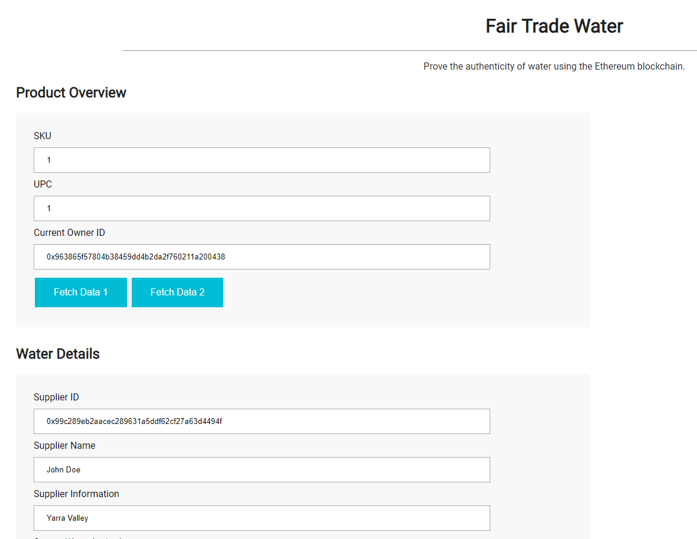

# Supply chain & data auditing

This repository containts an Ethereum DApp that demonstrates a Supply Chain flow between a Seller and Buyer. The user story is similar to any commonly used supply chain process. A Seller can add items to the inventory system stored in the blockchain. A Buyer can purchase such items from the inventory system. Additionally a Seller can mark an item as Shipped, and similarly a Buyer can mark an item as Received.

The DApp User Interface when running should look like...





## Architecture

### UML:
Unified Modeling Language (UML) is used in this project to visualize the design of the Supply Chain solution problem and thus laying the foundation for designing the smart contracts.
The different types of UML diagrams used in the project are discussed below:
a)	Class Diagram – It is a structure diagram and shows the classes, relationships, interface and association between the different components of the system's classes, attributes, operations, and how the objects are connected. 
In our case we have 4 different actors – Supplier who is responsible for collecting, filtering and packing of water at the source, Distributors who buys the water from the Supplier and ships to the Retailer. End users or Consumers purchase the water from the Retailer. Each of them has a separate address which are added in the system and used for validation and security feature. This is referred to as the Access Control. The access control contracts manage the various addresses and constraints for operations that can be executed only by specific roles. Then we have the Base class which inherits from the Access Control and contains the main functionality implemented in SupplyChain.sol file. The Core class manages the ownership.

b)	State diagram: - Shows changes from one state to another and depicts the creation state and final states. The initial state is the water at the source and the final state is the packaged water that an end user or consumer buys for drinking. It is also used to show the events responsible for change in state. 

c)	Activity diagram: - An activity diagram is essentially a flowchart that shows activities performed by a system. It shows the flow of one activity to another in the system. This helps the system to maintain the same set of processes and behavior. Here the Supplier first disinfect the water, collect it, filter it and then adds for Sale. This is purchased by a distributor who ships it to Retailer. The end user ultimately purchases the water from retailer for consumption.

d)	Sequence diagram: - It shows the Integration between objects in the sequence in which they take place.

### Libraries (Truffle, Truffle-contract, Etherium):
Etherium is the blockchain which records all executed codes as transactions and the ether is the cryptocurrency which fuels the Ethereum blockchain. Our SupplyChain smart contract is a piece of software containing all rules and regulations for negotiating the terms of a contract. It automatically verifies the contract and then executes the agreed upon terms. But the Ethereum blockchain helps it make decentralized. In order to host it in Ethereum blockchain we wrote the contract in Solidity.
The contract is deployed in Ethereum blockchain using Infura and Truffle.  Truffle is a critical component of the Ethereum ecosystem. It helps to compile the solidity code into Ethereum Virtual Machine bytecode and create an Application Binary Interface. It comes packaged with Mocha and chai and was used for testing the different functions of smart contract. It was also used to deploy the smart contract on Rinkeby test network and also in the local network Ganache.
The Truffle_contract helps in synchronizing the transactions so that we can use async/await instead of the callback hell. It use promises and allows to perform contract operation and methods in Javascript. It makes the calling of smart contract from the dapp easier.
Web3 is needed to interact with the contract from the browser. So it helps to perform actions like sending ether to another address, read and write data data to the blockchain from the Dapp. Setting a Web3 Provider in app.js tells our code which node we should be talking to handle our reads and writes. 
Infura is used to access an Ethereum node without having one. It is a service which provides a remote Ethereum node for free.
The users sign transactions with their private key managed by Metamask. It  is a browser extension for Chrome and Firefox that lets users securely manage their Ethereum accounts and private keys and use these accounts to interact with websites that are using Web3.js. Metamask injects their web3 provider into the browser in the global JavaScript object web3. So the dapp checks to see if web3 exists, and if it does use web3.currentProvider as its provider.

### Methodology:
1)	Plan the Project by Creating the UML Diagrams described earlier
2)	Downloaded the Starter code provided at https://github.com/udacity/nd1309-Project-6b-Example-Template
3)	Complete the Access Control contracts, Base Contract and the core Contract.
4)	Installed the HD Wallet provider using npm install truffle-hdwallet-provider
5)	Launch Ganache using ganache-cli -m “….”
6)	Compiled the project using truffle.cmd compile
7)	Test the smart contract using Truffle.cmd test
8)	Create an account in Infura
9)	Create a  project in Infura and get the Address fro deploying in Rinkeby test network
10)	Copy the endpoint address and update the Rinkeby network information with the mnemonic and endpoint address in Truffle.js file
11)	Fund the metamask wallet by posting a tweet in https://faucet.rinkeby.io. The post should have the address “ Requesting faucet funds into …….  On the Rinkeby Ethereum test network”
Then copy the tweet in the above website and click Give  me Ether.
12)	Then deploy it using truffle.cmd deploy - -network rinkeby.
13)	If needed to deploy again use truffle.cmd migrate - -network rinkeby - - reset  - -compile-all
14)	Update the html and the app.js page for the client side UI.
15)	Test the UI after starting the lite server using npm run dev


## Versions Used:
Truffle – 4.1.15
Truffle-hdwallet-provider – 1.0.5
Node – 10.7.0


## SupplyChain Contract Address:

"address": "0x6f61f812fe7ff70be75257ae4d65222f52abf493"

"transactionHash": "0x0bfa238c4a1d69ca52b8e442bb992b9abf9247b0fea646afaf3c808644ab102b"


## Getting Started

These instructions will get you a copy of the project up and running on your local machine for development and testing purposes. See deployment for notes on how to deploy the project on a live system.

### Prerequisites

Please make sure you've already installed ganache-cli, Truffle and enabled MetaMask extension in your browser.

```
Give examples (to be clarified)
```

### Installing

A step by step series of examples that tell you have to get a development env running

Clone this repository:

```
git clone https://github.com/udacity/nd1309/tree/master/course-5/project-6
```

Change directory to ```project-6``` folder and install all requisite npm packages (as listed in ```package.json```):

```
cd project-6
npm install
```

Launch Ganache:

```
ganache-cli -m "spirit supply whale amount human item harsh scare congress discover talent hamster"
```

Your terminal should look something like this:


In a separate terminal window, Compile smart contracts:

```
truffle compile
```

Your terminal should look something like this:


This will create the smart contract artifacts in folder ```build\contracts```.

Migrate smart contracts to the locally running blockchain, ganache-cli:

```
truffle migrate
```

Your terminal should look something like this:


Test smart contracts:

```
truffle test
```

All 10 tests should pass.


In a separate terminal window, launch the DApp:

```
npm run dev
```

## Built With

* [Ethereum](https://www.ethereum.org/) - Ethereum is a decentralized platform that runs smart contracts
* [IPFS](https://ipfs.io/) - IPFS is the Distributed Web | A peer-to-peer hypermedia protocol
to make the web faster, safer, and more open.
* [Truffle Framework](http://truffleframework.com/) - Truffle is the most popular development framework for Ethereum with a mission to make your life a whole lot easier.


## Authors

See also the list of [contributors](https://github.com/your/project/contributors.md) who participated in this project.

## Acknowledgments

* Solidity
* Ganache-cli
* Truffle
* IPFS
